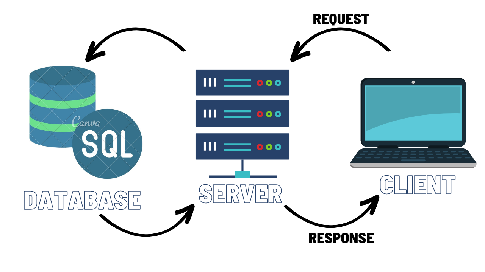

# Project Name
 
## movies library 

---------------

## Project Version

1.0.0

---------------
**Author Name**: Rama Al-momani

---------------

## WRRC with DB

---------------

## Overview: Getting Started 

**On the terminal**

1. Clone your repository.
2. install Node.js 'make sure that you have the latest version'.
3. running npm init -y command.
4. Install the required packages like express and cors by running npm install express cors, we need axios and dotenv packages so do npm install axios dotenv.For lab 13 we needa new package, so do npm i pg.

5. Open VS code, and create your .js file.
6. On .js file require the packages that you already installed in step 4.
7. creat your app then use the packages that you've required.
8. app.listen('port number ex:' (4000)).
9. then on the terminal do npm start to start your server.

---------------

## Project Features

Routes:

1. when the user route to trending page he will get the trending movies data from the movie DB API
2. when the user route to search page he can search for any movie name, then the information of this specific movie will apper.
3. when the user route to movieGenres page he will get the list of official genres for movies.
4. when the user route to certifications page he will get an up to date list of the officially supported movie certifications on TMDB.
5. while when the user route to the favorite page a Welcoming message will appear.
6. getMovie endpoint to add movie using get req.
7. addMovie to get the list of movies added using post req.
8. getMovie/id: endpoint to get a specific movie from the database using id.
9. /UPDATE/id: endpoint to update the comments for a specific movie in the database.
10. /DELETE/id: endpoint to remove a specific movie from your database.
