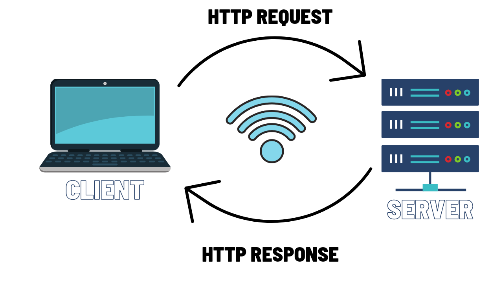

# Project Name
 
## movies library 

---------------

## Project Version

1.0.0

---------------
**Author Name**: Rama Al-momani

---------------

## WRRC 

---------------

## Overview: Getting Started 

**On the terminal**

1. Clone your repository.
2. install Node.js 'make sure that you have the latest version'.
3. running npm init -y command.
4. Install the required packages like express and cors by running npm install express cors.
5. Open VS code, and create your .js file .
6. On .js file require the packages that you already installed in step 4.
7. creat your app then use the packages that you've required.
8. app.listen('port number ex:' (4000)).
9. then on the terminal do npm start to start your server.

---------------

## Project Features

Routes: when the user route to the home page the movie's details will appear for him, while when the user route to the favorite page a Welcoming message will appear for him